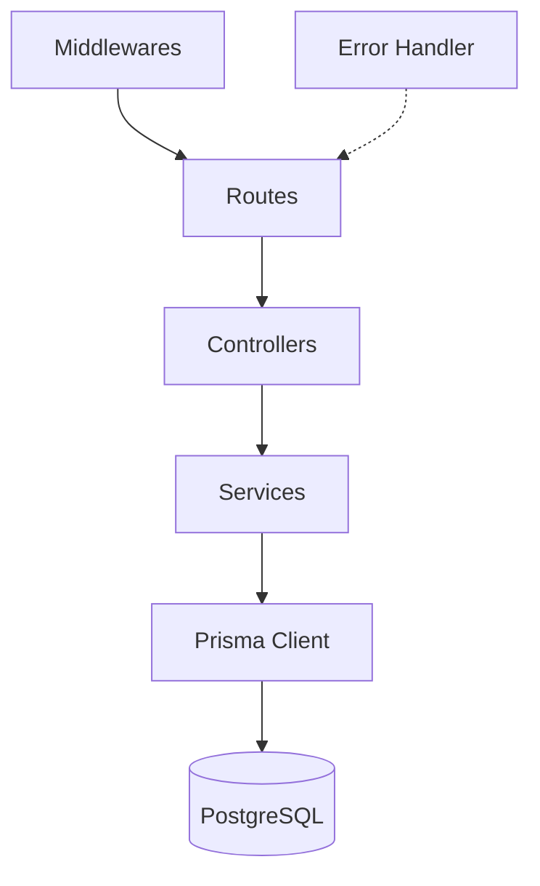

# E-commerce API Scalable

<div align="center">


**API RESTful profesional para e-commerce con autenticación JWT, carrito, órdenes, pagos simulados y arquitectura modular escalable**

[Características](#-características) •
[Instalación](#-instalación-rápida) •
[Documentación](#-documentación) •
[API](#-api-endpoints) •
[Seguridad](#-seguridad)

</div>

---

## Descripción

**E-commerce API Scalable** es un backend moderno construido con Node.js, Express y Prisma que implementa un flujo completo de tienda online: autenticación, catálogo de productos, carrito de compras, creación de órdenes y checkout de pago simulado.

### Objetivo

Proveer una base robusta y limpia para proyectos reales de comercio electrónico, con buenas prácticas de seguridad, validaciones, manejo de errores y estructura mantenible.

---

## Características

### Core Features
- **Autenticación JWT**: Registro y login con tokens seguros
- **Gestión de usuarios**: Perfil del usuario autenticado (`/api/users/me`)
- **Catálogo de productos**: CRUD completo con control de rol admin
- **Paginación y filtros**: Listado de productos por nombre y rango de precios
- **Carrito de compras**: Agregar, listar y eliminar ítems
- **Órdenes de compra**: Conversión de carrito a orden con cálculo de total
- **Pago simulado**: Checkout que actualiza el estado de orden a `paid`

### Technical Features
- **Arquitectura modular por dominio** (`auth`, `users`, `products`, `cart`, `orders`, `payments`)
- **Prisma ORM + PostgreSQL**
- **Validaciones con Zod**
- **Control de acceso por roles** (`ADMIN` / `CUSTOMER`)
- **Manejo centralizado de errores HTTP**
- **Logs con Winston + Morgan**
- **Rate limiting y hardening básico con Helmet**
- **Swagger/OpenAPI** para documentación interactiva
- **Tests con Jest + Supertest**
- **Redis opcional** para caché de listados

---

## Arquitectura

### Estructura del Proyecto

```text
src/
├── config/                 # DB, env, redis
├── docs/                   # Swagger setup
├── middlewares/            # auth, roles, validación, errores
├── modules/
│   ├── auth/
│   ├── users/
│   ├── products/
│   ├── cart/
│   ├── orders/
│   └── payments/
├── routes/                 # Router principal
├── utils/                  # helpers compartidos
├── app.js                  # configuración Express
└── server.js               # bootstrap del servidor

prisma/
├── schema.prisma
└── seed.js

tests/
├── unit/
└── app.health.test.js
```

### Flujo de Capas



---

## Tecnologías

| Tecnología | Versión | Propósito |
|-----------|---------|-----------|
| **Node.js** | 20+ | Runtime principal |
| **Express** | 4.x | Framework HTTP |
| **Prisma** | 5.x | ORM y acceso a datos |
| **PostgreSQL** | 14+ | Base de datos principal |
| **JWT** | 9.x | Autenticación por token |
| **Zod** | 3.x | Validación de datos |
| **Swagger** | 6.x / UI 5.x | Documentación API |
| **Redis (opcional)** | 7+ | Caché |
| **Jest + Supertest** | 29.x / 7.x | Testing |

---

## Instalación Rápida

### Prerequisitos

- **Node.js 20+**
- **PostgreSQL 14+**
- **Redis 7+** (opcional)

### Pasos de instalación

1. **Clonar repositorio**
   ```bash
   git clone <tu-repo>
   cd ecommerce-api-scalable
   ```

2. **Instalar dependencias**
   ```bash
   npm install
   ```

3. **Configurar entorno**
   ```bash
   cp .env.example .env
   ```

4. **Migrar y generar Prisma**
   ```bash
   npx prisma migrate dev --name init
   npx prisma generate
   ```

5. **Cargar datos seed**
   ```bash
   node prisma/seed.js
   ```

6. **Levantar servidor**
   ```bash
   npm run dev
   ```

---

## Documentación

- **API base**: `http://localhost:3000`
- **Health check**: `GET /health`
- **Swagger UI**: `http://localhost:3000/api/docs`

---

## API Endpoints

### Auth
- `POST /api/auth/register`
- `POST /api/auth/login`

### Users
- `GET /api/users/me`

### Products
- `GET /api/products`
- `GET /api/products/:id`
- `POST /api/products` (admin)
- `PUT /api/products/:id` (admin)
- `DELETE /api/products/:id` (admin)

### Cart
- `GET /api/cart`
- `POST /api/cart/add`
- `DELETE /api/cart/remove/:id`

### Orders
- `POST /api/orders`
- `GET /api/orders`

### Payments
- `POST /api/payments/checkout`

---

## Seguridad

### Autenticación JWT

1. Hacer login con credenciales válidas.
2. Recibir token JWT en la respuesta.
3. Enviar el token en `Authorization: Bearer <token>`.
4. Acceder a endpoints protegidos según rol.

### Control de roles

- `ADMIN`: CRUD de productos y visibilidad global de órdenes.
- `CUSTOMER`: flujo de compra propio (carrito, órdenes, pagos).

---

## Testing

```bash
npm test
```

Incluye pruebas de:
- salud de aplicación y fallback 404
- utilidades de paginación
- validación de checkout

---

## Datos iniciales (seed)

Se crea automáticamente:
- Usuario admin: `admin@ecommerce.com` / `admin12345`
- Productos demo

---

## Scripts útiles

- `npm run dev` - desarrollo con nodemon
- `npm start` - ejecución estándar
- `npm test` - suite de tests
- `npm run prisma:generate`
- `npm run prisma:migrate`
- `npm run prisma:seed`

---

## Licencia

Este proyecto está bajo la licencia **MIT**.
